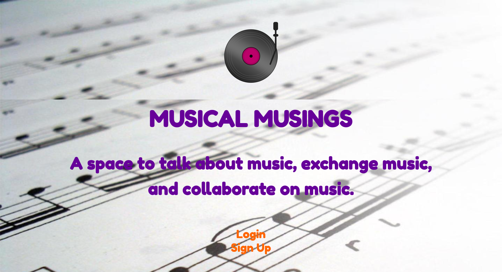

# MUSICAL-MUSINGS

## DESCRIPTION

Musical Musings is an application that allows people to exchange ideas and opinions about the world of music. This project uses Node.js, Express.js, Handlebars.js, Sequelize, a MySQL database, and Cloudinary. Cloudinary provides an API for image management.

The user can sign up and log in to the application, and their information will be safely secured and saved to the back-end for future use. 

## USER STORY

AS A lover of music
I WANT a social-networking-style website dedicated to music
SO THAT I can write about and post images of my musical experiences as well as read and comment on other people's posts about their musical experiences

## PROCESS

Before doing any coding, we talked as a group to look over the assignment requirements and think about an application that would be useful as well as interesting to all group members. Because we shared a love of music, we thought it would be within the realm of this project to create a social-networking-style app that allows users to log in and post about music. They would also be able to comment on other people's posts. 

Once we had solidified an idea, we created the repo in GitHub that included the main branch as well as each member's individual branch. 

We then started organizing all of the folders and files that we knew we would need, using the MVC paradigm and referring back to past activities from class. 

To start coding each file, each group member took a section of the repo and started filling in standard code that we had seen in past activities. We then looked over this code and made sure it was adapted to our particular app. Once this was done, we installed all necessary node modules and then tested the router, the app, and MySQL, making sure that we could at least connect to the server and see that the handlebars pages were showing up in the browser. 

Next, we focused on the styling of the website in CSS. We also designed a logo. 

The next few days involved tweeking the code to include another section to the website and make sure that everything was working well. We also decided to use Cloudinary as our new technology, allowing the user to upload images to their post. 

The last few steps involved testing out the website as much as possible and tightening up the code. 

Here are some images of the Musical Musings app: 

## INSTALLATION

The Musical-Musings app is deployed in Heroku via the [Musical-Musings Heroku link](https://intense-dusk-91957.herokuapp.com).

The user can also access the app by using the Node.js command "npm start" in the Terminal of the Musical-Musings repo in VS Code. This will start the router in localhost:3001 in the user's browser. 

## IMPROVEMENTS

As with any application, there is always room for improvement. We talked about a few ideas for this app that we simply did not have the time to include. Given more time, we would have added another link to a "music exchange" page, where users could post and exchange and/or sell albums and concert tickets. We also talked about including an API that would allow users to play/listen to music. Another possible feature would be a live chat page. 

## CONCLUSION

This project involved a lot moving parts. Working with a group made it seem much more manageable and less intimidating. Talking about bugs and being able to look at each other's code with fresh eyes greatly improved the process. It also gave us the opportunity to practice git branching and merging, which is important for any future coding job. 

Having different people working on the same project also helps in managing frustrations when the code is not working well. Even though there are times in which even a group can get stuck, it is valuable to have people to talk over what could be going wrong, as well as share in the breakthroughs and successes. 